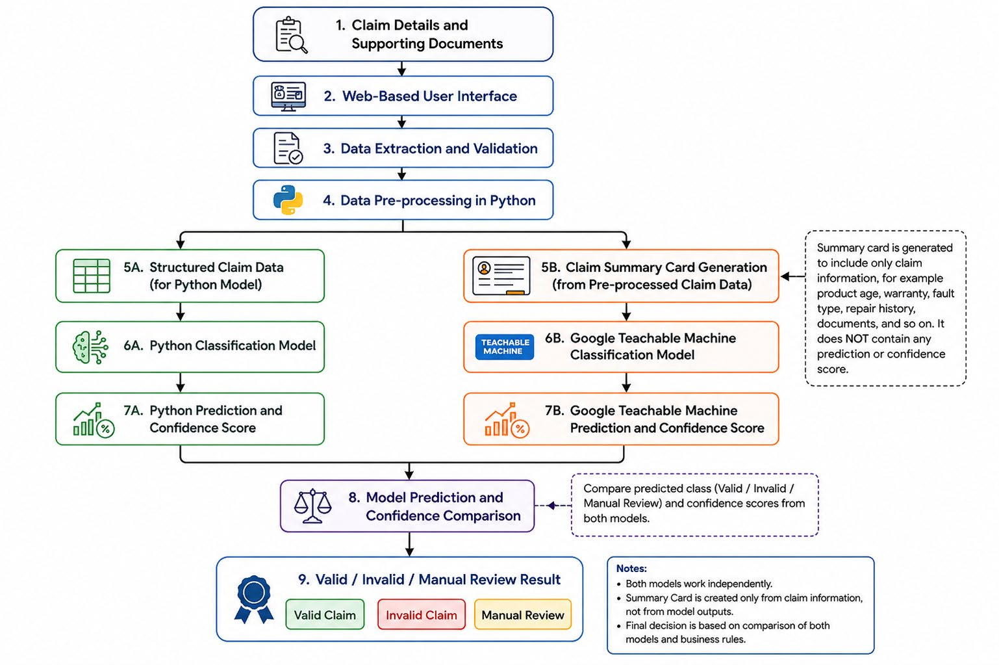

# AssureX Claim Engine - Application Visual Walkthrough & Screenshots

This directory fulfills **SRS Deliverable #2 & Deliverable #11 (Pages 25 & 33)** by documenting the user interfaces, portal workspaces, and adjudication lifecycle screens of the live deployed application at **[https://assurexai.pythonanywhere.com](https://assurexai.pythonanywhere.com)**.

---

## 1. High-Level System Architecture

*Figure 1: Full-stack pipeline illustrating user intake, OCR extraction, dual-model consensus synthesis, policy rule adjudication, and immutable audit logging.*

---

## 2. Portal Visual Workspaces

### Portal 1: Customer Self-Service Portal (`/claims/`)
- **Fleet Asset Inventory:** Lists all registered consumer electronics, home appliances, and industrial tools with active warranty policy countdowns.
- **5-Step Interactive Intake Wizard (`/claims/new`):**
  - Step 1: Equipment Selection with dynamic serial lookup.
  - Step 2: Fault declaration, defect taxonomy, and estimated claim value.
  - Step 3: Document drag-and-drop intake with SHA-256 hash generation and live OCR verification.
  - Step 4: Programmatically rendered 640x420 Claim Summary Card preview for GTM vision classification.
  - Step 5: Truthfulness legal declaration and 1-click Dual-Model execution.
- **8-Stage Live Claim Tracker (`/claims/<id>/track`):** Real-time lifecycle bar tracking the exact state transition across Draft, Submitted, Under Evaluation, Manual Review, Additional Info, Approved, Rejected, and Settled.

### Portal 2: Senior Claim Reviewer Workspace (`/reviewer/queue`)
- **Triage Queue:** Filterable by status (`Manual Review`, `Additional Info Requested`), risk tier (`Low`, `Medium`, `High`), and hardware category.
- **Side-by-Side Adjudication Inspection (`/reviewer/claim/<id>`):**
  - Dual-model comparison matrix displaying Python Tabular vs GTM Vision confidence distributions.
  - Policy rule execution breakdown (Hard-fail vs Warning triggers).
  - Chronological contradiction & duplicate serial collision flags.
  - Reviewer Override controls with mandatory justification audit notes.

### Portal 3: Executive Administrator Dashboard (`/admin/dashboard`)
- **Real-Time Portfolio KPIs:** Total claims, approval/rejection rates, fleet volume, and reviewer throughput.
- **AI Disagreement Analytics:** Live tracking of divergence frequency between tabular ML and computer vision models.
- **Dynamic Policy Editor (`/admin/policies`):** Live modification of category warranty terms, grace windows, and coverage JSON without code redeployment.
- **Immutable Security Audit Trail (`/admin/audit-logs`):** Chronological logging of all authentications, claim evaluations, and reviewer actions.
- **One-Click CSV Data Exporters (`/admin/export/<dataset>`):** Streamable structured exports for offline business intelligence and regulatory compliance.

### Portal 4: Public Presence & Educational Presence (`/` & `/blog`)
- **Interactive Role Switcher Sandbox:** Instant 1-click test credentials for evaluators.
- **Technical Blog (`/blog`):** 3,790+ word publication covering all 23 SRS technical topics with direct link to the [Medium publication](https://medium.com/@samikhan031027/building-assurex-a-dual-model-warranty-claim-evaluation-system-8a30d3684111).
